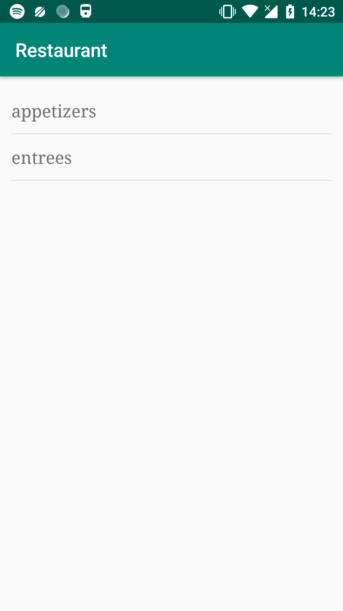
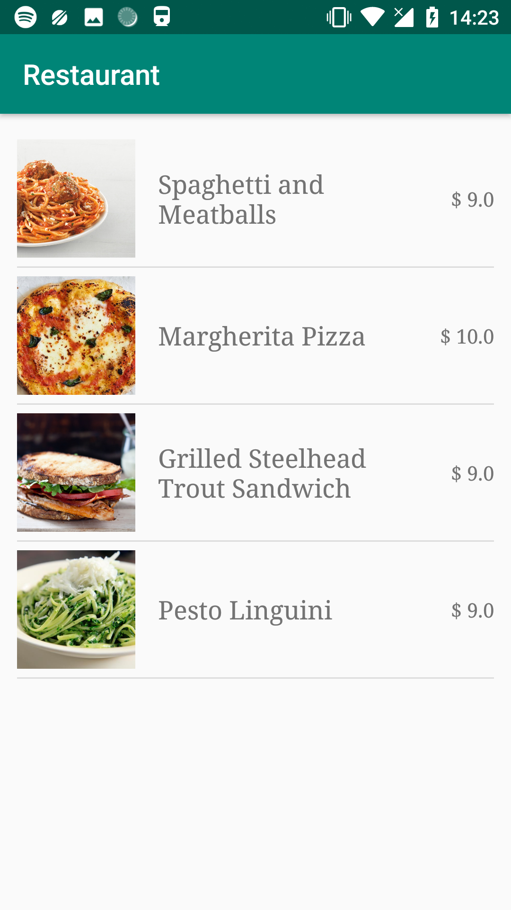
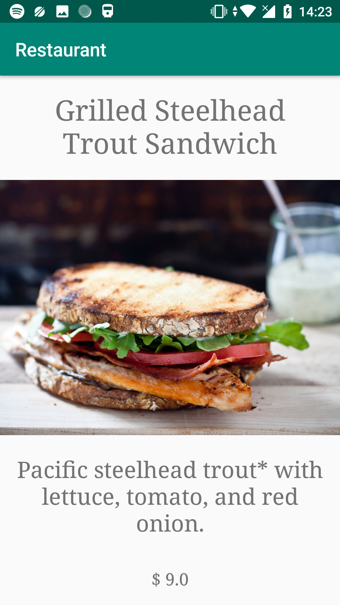
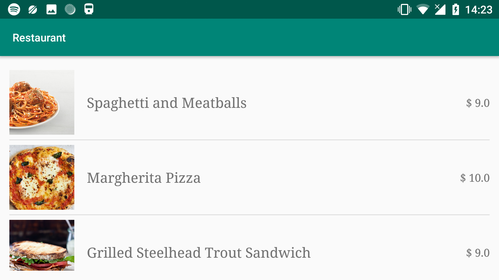

# Restaurant

## Author info
**Name:** Stefan Klut  
**Studentnumber:** 11331720  
**email:** stefanklut12@gmail.com

## Description
This is an app for viewing the menu of a fake restaurant. The information that is visible in the app is all retrieved from a web API.
On the opening screen there is a choice between the different categories of menus (e.g. appetizers or entrees). 
By clicking one of the categories, you load a new actvity where the menu is visible. With pictures and information about the dishes.
All this is also retrieved by asking the API. the shown dishes are dependend on the first category selected.
Clicking on a dish will open a new activity with additional information about the dish.

## Screenshots

### Categories selection:

### Menu item selection:

### Displayed menu item:

### Landscape mode:

